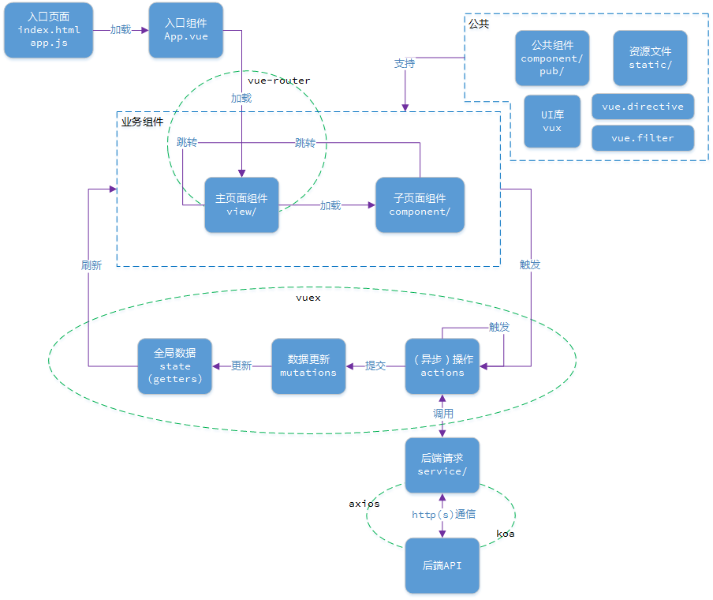

## 一些说明

> 学习并整理一套移动端web开发解决方案

> 前端框架基于Vue搭建，涉及Vuex，请求用axios

> 后端框架采用基于nodejs的Egg框架

## 目录
#### &sect; 架构设计
 * [前端架构](#前端架构)
 * [后端架构](#后端架构)

****

## &sect; 架构设计

 * ### <a name="前端架构">前端架构</a>

 * ### <a name="后端架构">后端架构</a>（最近加班很忙加上各种事项，学习进度缓慢，后续工作稳定了再补上）

> 下面是egg的知识要点笔记，请无视！

> 框架内部针对表单 POST 请求均会验证 CSRF 的值，因此我们在表单提交时，请带上 CSRF key 进行提交，可参考安全威胁csrf的防范

> 框架推荐 Controller 层主要对用户的请求参数进行处理（校验、转换），然后调用对应的 service 方法处理业务，得到业务结果后封装并返回

> 我们建议用 context.get(name) 而不是 context.headers['name']，因为前者会自动处理大小写
